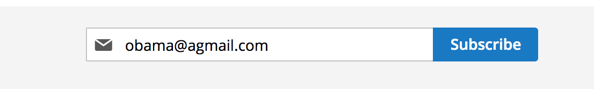

# Email subscribe

Function 



```javascript
web_event.track("email", "subscrible", {
    extra: {the detail info} // option
});
```

Sample data for event after user has .  

```javascript
web_event.track("email", "subscrible", {
    extra: { 
     "email":"obama@agmail.com"
}
});                                            
```

