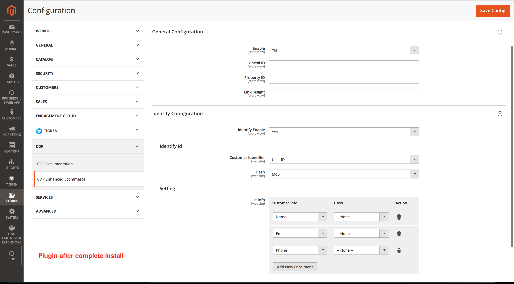

# Ecommerce Platform: Magento

* **Step 1:** Download [**extension files**](https://firebasestorage.googleapis.com/v0/b/gitbook-28427.appspot.com/o/assets%2F-LvxycBHx7ziVQP2E5we%2F-MAOtNen4VPGBBirwN_z%2F-MAOuFVxIEJfGItc3g4B%2FCDP.zip?alt=media&token=3cccd292-c292-4285-84c9-8895930f487c)\*\*\*\*
* **Step 2:** Copy the extension files to below paths of your magento 2 instance. If 'app/code/CDP' folder is missing, please create it manually: app/code/CDP 
* **Step 3:**. Access the root of your magento 2 project from command line and run the following commands: 
  * php bin/magento module:enable CDP\_Backend --clear-static-content ;
  * php bin/magento module:enable CDP\_Insight --clear-static-content ; 
  * php bin/magento setup:upgrade ; 
  * php bin/magento cache:flush ; 
  * php bin/magento setup:di:compile ; 
  * php bin/magento setup:static-content:deploy -f vi\_VN en\_US -j5
  * 
* **Step 4:** Flush any cache that you might still have enabled on your server or in Magento. 
* **Step 5:** Woohoo, the extension is installed!

